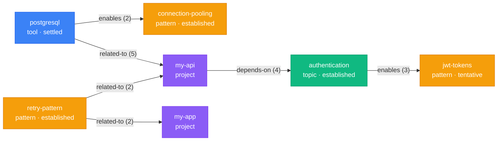
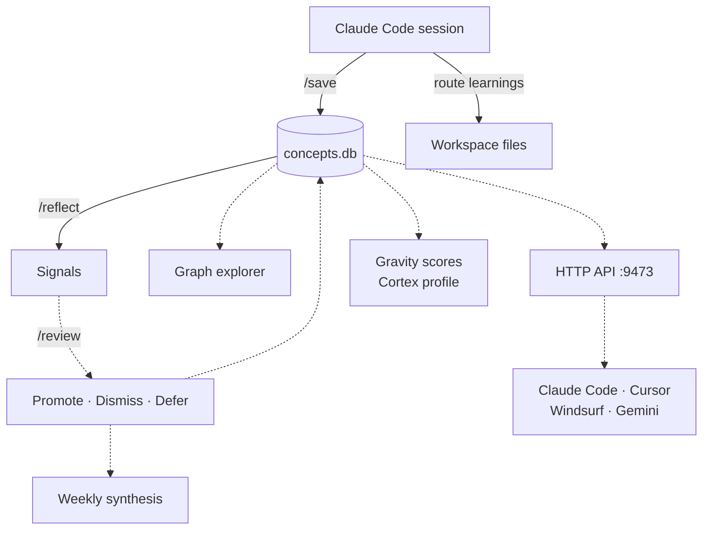

# Cortex

<div align="center">


</div>

<br />

Your AI starts every conversation from zero. Cortex gives it memory that grows from your actual work.

Two skills and a CLI. No background processes, no magic.

## Where cortex fits

There are three levels to getting AI memory right:

<div align="center">

</div>

<br />

**Remember.** Write things down. Every AI tool does this now. Table stakes.

**Forget.** Clean up what you wrote. Anthropic's Auto Dream handles this for Claude Code: deduplicating entries, fixing dates, pruning stale context. Real progress at the platform level.

**Connect.** Surface patterns across projects you would not notice yourself. Flag when a decision in one project contradicts an assumption in another. Catch the idea you mentioned three times but never acted on.

Most tools stop at forget. Cortex picks up where cleanup ends. It runs alongside Auto Dream, not instead of it. Cleaning and connecting are different jobs.

```
  SESSION                    /save                      KNOWLEDGE GRAPH              /reflect
  -------                    -----                      ---------------              --------

  +------------+      +----------------+      +--------------------+      +-------------------+
  | Decisions  |      | Daily notes    |      |   postgresql       |      | Stale: 3 entries  |
  | Patterns   | ---> | Project context| ---> |     / | \         | ---> | Friction: 2 ready |
  | Friction   |      | MEMORY.md      |      |  auth  pool  api  |      | Signals: 1 convg  |
  | Concepts   |      | Learnings      |      |     \ | /         |      | Promote: 1 cand   |
  +------------+      +----------------+      |    my-api         |      +-------------------+
                        4 destinations         +--------------------+       5 analysis passes
```

## The problem

Every AI tool that tries to remember you eventually drowns in its own notes. By month three your memory is full of duplicates, contradictions, and stale context. The AI that was supposed to know your work starts to feel like a colleague who has been on sabbatical for six months.

## What cortex does

**`/save`** captures session learnings and routes them to the right place. **`/reflect`** reviews what's accumulated and surfaces patterns you'd miss. The **concepts CLI** builds a knowledge graph across sessions so your AI connects ideas across projects and time.

## Install

```bash
# Clone anywhere
git clone https://github.com/vednikolic/cortex.git

# Run the installer -- it will ask for your workspace path
cd cortex
bash install.sh
```

The installer prompts for your workspace directory (the root where you run Claude Code). It copies `/save` and `/reflect` skills into that workspace's `.claude/skills/`, installs the `concepts` CLI to `~/.cortex/`, and optionally creates `.memory-config` for path customization.

Requires [Claude Code](https://docs.anthropic.com/en/docs/claude-code). Python 3.10+ (stdlib only, no pip dependencies).

## Quick start

After install, start a Claude Code session in your workspace and run `/save` at the end. That's it. The knowledge graph initializes automatically on first use.

## What happens when you /save

```
> /save

Session saved.

Daily note (2-areas/me/daily/2026-03-24.md):
  Work: Fixed auth race condition, drafted API migration plan
  Tasks: 3 new, 2 carried over, 1 completed

Project CLAUDE.md (my-api):
  Decisions: Use connection pooling over per-request connections [settled]
  Friction: Third time manually restarting dev server after config change

Global MEMORY.md (47/200 lines):
  Added: retry-with-backoff pattern (reusable across projects)

Graph: 12 concepts, 8 edges, 2 projects.
  Tip: Run 'concepts graph' to see your knowledge graph.

Signals:
  Opportunity: retry wrapper in my-api maps to flaky-endpoint friction in my-app
```

`/save` routes each learning to one of four destinations:

| Where | What | Example |
|---|---|---|
| **Daily notes** | Work log, tasks, carry-overs | "Finished API migration, auth endpoint still needs tests" |
| **Project CLAUDE.md** | Decisions, state, friction | "Chose JWT with 24h expiry. Refresh tokens in httpOnly cookies" |
| **MEMORY.md** | Cross-project patterns, environment | "Use per-project venvs, never system Python" |
| **Learnings** | Working style, preferences | "Breaking PRs into <300 lines gets faster reviews" |

Then it looks for signals: opportunities across projects, risk conflicts, converging needs.

## What happens when you /reflect

Run weekly or after heavy sessions. Five analysis passes over your accumulated memory:

```
> /reflect

Stale (3):
  "Redis caching layer" -- not referenced in 14 days
  "Feature flag rollout plan" -- not referenced in 21 days

Friction escalation:
  "Manual dev server restart" -- 4 occurrences, automation candidate
  Proposed fix: add watchdog to dev config

Cross-project signals:
  CONVERGENCE: my-api event logging + my-app telemetry + dashboard
    cost tracking all need a shared event bus

Promotion candidates:
  "Always seed test data in fixtures, never in test bodies"
  -- seen 3 times, mature enough for CLAUDE.md rule
```

`/reflect` never modifies your files. It surfaces findings. You decide what to act on.

## Knowledge graph

The `concepts` CLI tracks what you work with across sessions. `/save` populates it automatically. You rarely need to touch it directly, but when you do:

```bash
# See what's in your graph
concepts graph
# Concepts: 24
# Edges: 18 (avg 0.75/concept)
# Projects: 3
# Confidence: {'settled': 8, 'established': 10, 'tentative': 6}

# Find cross-project concepts
concepts shared
# authentication (tool) - 3 projects: my-api, my-app, admin-dashboard
# retry-pattern (pattern) - 2 projects: my-api, my-app

# What's trending
concepts hot --limit 5
# postgresql (tool) - sources: 12, edges: 6
# authentication (tool) - sources: 8, edges: 4

# Query a specific concept
concepts query postgresql
# postgresql (tool, settled)
#   Aliases: postgres, pg
#   Sources: 12 | First: 2026-01-15 | Last: 2026-03-24
#   Edges (4):
#     -> authentication [related-to] (strength=3)
#     -> connection-pooling [enables] (strength=2)
#     -> my-api [related-to] (strength=5)

# Fix a mistake
concepts correct "postgress" "postgresql"
concepts undo-last
concepts merge "js" "javascript"
```

### How the graph grows

1. You work normally and run `/save`
2. `/save` computes a session weight (1-5) based on decisions, concepts, and friction detected
3. Heavier sessions extract more concepts (up to 8). Light sessions extract fewer (up to 3)
4. Canonicalization prevents duplicates: "k8s" matches "kubernetes", "pytohn" matches "python"
5. Over time, the graph reveals which concepts connect your projects, which are going stale, and where patterns repeat

### What the graph looks like



Each node is a **concept** with a kind and confidence level. Edges carry a **relation type** and **strength** that increments each time the relationship is reinforced across sessions. `retry-pattern` appearing in both `my-api` and `my-app` is the kind of cross-project signal `/reflect` surfaces.

### Preparing graph data for /reflect

```bash
concepts reflect-prep              # Generate reflect-context.json
concepts reflect-prep --verify     # Check if data is fresh
```

Run `reflect-prep` before `/reflect` to give it structured graph data. Without it, `/reflect` still works but relies on text matching instead of graph queries.

## Configuration

Create `.memory-config` in your workspace root:

```
daily_dir: 2-areas/me/daily
learnings: 2-areas/me/learnings.md
reflect_log: 2-areas/me/reflect-log.md
project_root: 1-projects
workspace: personal
```

Without `.memory-config`, PARA defaults are used. See `.memory-config.example` for the full template.

## Testing

```bash
python3 -m venv .venv && source .venv/bin/activate
pip install pytest
python -m pytest tests/ -v    # 66 unit tests
```

LLM evals (requires Claude Code):

```bash
cd evals
python3 eval.py ../.claude/skills/save/SKILL.md --evals extraction_evals.json --verbose
python3 eval.py ../.claude/skills/reflect/SKILL.md --evals reflect_graph_evals.json --verbose
```

## CLI reference

| Command | What it does |
|---|---|
| `concepts init` | Create concepts.db in workspace root |
| `concepts upsert <name>` | Create or update a concept |
| `concepts edge <from> <to> <relation>` | Create or strengthen a relationship |
| `concepts query <name>` | Show a concept with its edges and sources |
| `concepts list` | List all concepts |
| `concepts shared` | Concepts appearing in 2+ projects |
| `concepts stale` | Concepts not referenced recently |
| `concepts hot` | Most active concepts |
| `concepts graph` | Graph summary |
| `concepts stats --weights` | Weight distributions across extractions |
| `concepts merge <source> <target>` | Merge two concepts |
| `concepts correct <old> <new>` | Rename a concept |
| `concepts undo-last` | Revert the last extraction |
| `concepts verify` | Database integrity check |
| `concepts reflect-prep` | Generate reflect-context.json |

All commands support `--db <path>` and `--json`.

## What's next



Solid lines are live today. Dashed lines are planned.

- **Review and synthesis**: `/review` triages `/reflect` signals. Promote confident concepts, dismiss false edges, defer uncertain patterns. Weekly synthesis tracks how the graph evolves
- **Graph explorer**: Visualize and traverse the knowledge graph
- **Platform API**: Local HTTP API with MCP adapter so any AI coding agent can query your graph
- **Cortex profile**: Gravity scores measure concept centrality. Your profile emerges from what you build, not what you declare

## License

MIT. By [Ved Nikolic](https://github.com/vednikolic).
