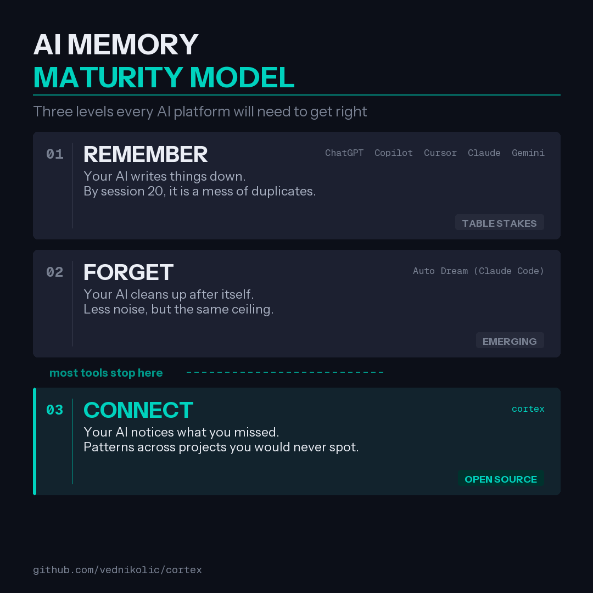
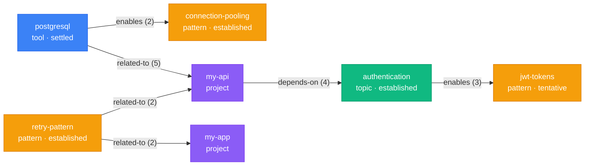
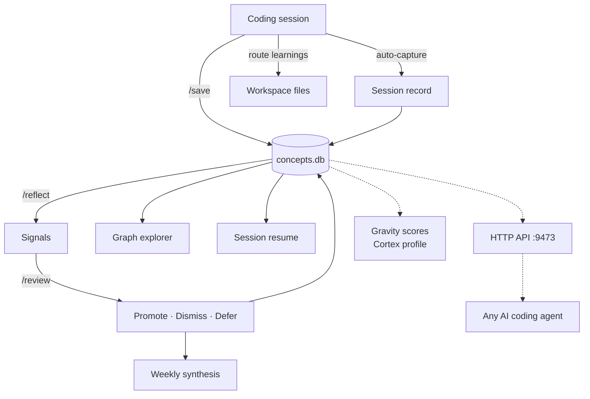

# Cortex

<div align="center">


</div>

## What this looks like in practice

You solve a retry problem in your API project on Monday. Three weeks later you are debugging flaky requests in a different project. Cortex surfaces the connection: "retry-pattern appears in both my-api and my-app, established confidence." You already solved this. Your AI knows.

You step away from a project for two weeks. When you come back, your session brief shows the 4 decisions that were pending, which concepts were active, and 2 sessions your AI captured while you were doing other work. No archaeology required.

You explain "always use connection pooling, not per-request connections" for the third time in a month. Cortex flags it as a re-explanation: proof that this decision is not sticking in context. Either the briefing needs adjustment or the concept needs promotion.

A junior dev's memory file has 200 lines after three months: duplicates, stale entries, things that contradict each other. Your graph has 120 concepts with confidence levels. The tentative ones fade on their own. The established ones resist decay. The settled ones shape every session.

## How cortex works

Three layers that compose into one system:

**Track.** Every session is recorded when it ends. What changed, which concepts were active, how long you worked. This happens automatically, even when you forget to `/save`. Nothing falls through the cracks.

**Structure.** `/save` routes each learning to the right destination: daily notes, project decisions, cross-project memory, or working style observations. The knowledge graph grows with each save, connecting concepts across projects and time.

**Curate.** `/reflect` surfaces what you would miss on your own: stale context piling up, friction recurring across sessions, concepts converging across projects. `/review` triages weekly so important concepts strengthen and noise fades naturally.

Most memory tools write things down. Cortex connects what was written, strengthens what matters, and ages out what doesn't.

```
  SESSION            /save             KNOWLEDGE GRAPH        /reflect           /review
  -------            -----             ---------------        --------           -------

  +----------+   +--------------+   +------------------+   +-----------------+   +-----------------+
  | Decisions|   | Daily notes  |   |   postgresql     |   | Stale: 3 entries|   | Promoted: 4     |
  | Patterns | > | Project ctx  | > |     / | \        | > | Friction: 2     | > | Dismissed: 1    |
  | Friction |   | MEMORY.md    |   |  auth  pool  api |   | Signals: 1      |   | Decayed: 0      |
  | Concepts |   | Learnings    |   |     \ | /        |   | Promote: 1 cand |   | Weekly synthesis |
  +----------+   +--------------+   |    my-api        |   +-----------------+   +-----------------+
                  4 destinations     +------------------+    7 analysis passes    weekly triage
```

## Where cortex fits

There are three levels to getting AI memory right:

<div align="center">

</div>

<br />

**Remember.** Write things down. Every AI tool does this now. Table stakes.

**Forget.** Clean up what you wrote. Deduplicating entries, fixing dates, pruning stale context. Real progress at the platform level.

**Connect.** Surface patterns across projects you would not notice yourself. Flag when a decision in one project contradicts an assumption in another. Catch the idea you mentioned three times but never acted on.

Most tools stop at forget. Cortex picks up where cleanup ends. Cleaning and connecting are different jobs.

## Install

```bash
# Clone anywhere
git clone https://github.com/vednikolic/cortex.git

# Run the installer -- it will ask for your workspace path
cd cortex
bash install.sh
```

The installer prompts for your workspace directory. It copies `/save`, `/reflect`, and `/review` skills into that workspace's `.claude/skills/`, installs the `concepts` CLI to `~/.cortex/`, deploys 9 automated hook scripts, and optionally creates `.memory-config` for path customization.

Requires an LLM coding assistant that supports `.claude/skills/` discovery. Python 3.10+ (stdlib only, no pip dependencies).

## Quick start

After install, start a session in your workspace and run `/save` at the end. That's it. The knowledge graph initializes automatically on first use. Session tracking starts working immediately with no additional setup.

## Session tracking

Every session is captured automatically when it ends. You never need to remember to save.

A Stop hook records the session: what changed (git diff), which files were touched, which concepts were active, and how long the session lasted. This happens on every session, including the ones where you forget to run `/save`.

When you start your next session, unprocessed sessions appear in your context brief so you can see what happened since you last checked in. Over time, session records feed into `/reflect` for pattern detection: which concepts keep getting re-explained, which areas generate the most churn, where your sessions cluster.

```bash
# See recent sessions
concepts sessions --limit 5

# Check health of the tracking system
concepts capture-health

# Clean up old session detail files
concepts capture-prune --days 30
```

Session tracking is the foundation. `/save` adds structure and routing on top. You get value from both independently, and more from both together.

## What you get from /save

```
> /save

Session saved.

Daily note (2-areas/me/daily/2026-03-24.md):
  Work: Fixed auth race condition, drafted API migration plan
  Tasks: 3 new, 2 carried over, 1 completed

Project CLAUDE.md (my-api):
  Decisions: Use connection pooling over per-request connections [settled]
  Friction: Third time manually restarting dev server after config change

Global MEMORY.md (47/200 lines):
  Added: retry-with-backoff pattern (reusable across projects)

Graph: 12 concepts, 8 edges, 2 projects.
  Tip: Run 'concepts graph' to see your knowledge graph.

Signals:
  Opportunity: retry wrapper in my-api maps to flaky-endpoint friction in my-app
```

`/save` routes each learning to one of four destinations:

| Where | What | Example |
|---|---|---|
| **Daily notes** | Work log, tasks, carry-overs | "Finished API migration, auth endpoint still needs tests" |
| **Project CLAUDE.md** | Decisions, state, friction | "Chose JWT with 24h expiry. Refresh tokens in httpOnly cookies" |
| **MEMORY.md** | Cross-project patterns, environment | "Use per-project venvs, never system Python" |
| **Learnings** | Working style, preferences | "Breaking PRs into <300 lines gets faster reviews" |

Then it looks for signals: opportunities across projects, risk conflicts, converging needs.

## What you get from /reflect

Run weekly or after heavy sessions. Seven analysis passes over your accumulated memory, querying the knowledge graph directly:

```
> /reflect

Stale (3):
  "Redis caching layer" -- not referenced in 14 days
  "Feature flag rollout plan" -- not referenced in 21 days

Friction escalation:
  "Manual dev server restart" -- 4 occurrences, automation candidate
  Proposed fix: add watchdog to dev config

Cross-project signals:
  CONVERGENCE: my-api event logging + my-app telemetry + dashboard
    cost tracking all need a shared event bus

Promotion candidates:
  "Always seed test data in fixtures, never in test bodies"
  -- seen 3 times, mature enough for CLAUDE.md rule
```

`/reflect` never modifies your files. It surfaces findings. You decide what to act on.

## What you get from /review

Run weekly. Triages accumulated signals and generates a synthesis snapshot:

```
> /review

Promotion eligible (5 concepts):

  Recommend promote:
  1. postgresql (5 sources, 3 projects)
     What: Your most-used database tool across my-api, my-app, and admin-dashboard.
     Why listed: 3+ sources AND 2+ projects. High-confidence cross-project concept.
     Promoting it: /reflect will prioritize postgresql connections in cross-project
     signals. It resists stale detection for 90 days instead of 60.

  2. retry-pattern (3 sources, 2 projects)
     What: Error handling pattern used in my-api and my-app.
     Why listed: Appears in 2 projects with 3 independent sources.
     Promoting it: Strengthens the signal that both projects share this need.

  Recommend defer:
  3. redis-caching (2 sources, 1 project)
     What: Caching layer discussed in my-api only.
     Why listed: 2 sources, but single-project and not referenced in 14 days.
     Deferring: Wait for a second project reference or continued usage.

Promoted 1-2 automatically. Deferred 3 (single-project, no recent references).
Tip: To undo a promotion, run `concepts correct <name>` or tell me to demote any by number.

Stale (1):
  "feature-flag-rollout" -- not referenced in 21 days

Review complete.

Triage:
  Promoted: 2 concepts (auto)
  Dismissed: 0 edges
  Deferred: 1 item

Weekly synthesis written to 2-areas/me/weekly/2026-03-24.md

Graph: 24 concepts, 18 edges, 3 projects
  This week: +4 concepts, +3 edges
```

Over time, the weekly directory builds a record of how your knowledge evolves: which concepts strengthened, what got dismissed, where your projects converge.

## Knowledge graph

The `concepts` CLI tracks what you work with across sessions. `/save` populates it automatically. You rarely need to touch it directly, but when you do:

```bash
# See what's in your graph
concepts graph
# Concepts: 24
# Edges: 18 (avg 0.75/concept)
# Projects: 3
# Confidence: {'settled': 8, 'established': 10, 'tentative': 6}

# Find cross-project concepts
concepts shared
# authentication (tool) - 3 projects: my-api, my-app, admin-dashboard
# retry-pattern (pattern) - 2 projects: my-api, my-app

# What's trending
concepts hot --limit 5
# postgresql (tool) - sources: 12, edges: 6
# authentication (tool) - sources: 8, edges: 4

# Query a specific concept
concepts query postgresql
# postgresql (tool, settled)
#   Aliases: postgres, pg
#   Sources: 12 | First: 2026-01-15 | Last: 2026-03-24
#   Edges (4):
#     -> authentication [related-to] (strength=3)
#     -> connection-pooling [enables] (strength=2)
#     -> my-api [related-to] (strength=5)

# Fix a mistake
concepts correct "postgress" "postgresql"
concepts undo-last
concepts merge "js" "javascript"
```

### How the graph grows

1. You work normally and run `/save`
2. `/save` computes a session weight (1-5) based on decisions, concepts, and friction detected
3. Heavier sessions extract more concepts (up to 8). Light sessions extract fewer (up to 3)
4. Canonicalization prevents duplicates: "k8s" matches "kubernetes", "pytohn" matches "python"
5. Over time, the graph reveals which concepts connect your projects, which are going stale, and where patterns repeat

### How concepts mature

Not every concept is equally important. Something you mention once might be noise. Something that shows up across three projects over two months is foundational. Cortex tracks this with three confidence levels:

| Level | What it means | What it does |
|---|---|---|
| **Tentative** | Seen once or twice. Might be noise, might be real. | Default for new concepts. Gets flagged as stale after 60 days without references |
| **Established** | Keeps showing up. This is a real part of your work. | Resists stale detection longer (90 days). Gets higher priority in /reflect cross-project signals |
| **Settled** | Foundational. Shapes how your projects connect. | Strongest resistance to decay. Highest priority in context injection and signal detection |

`/review` automatically promotes concepts that cross the threshold (3+ sources, or appears in 2+ projects). You see what was promoted and can adjust, demote, or dismiss anything you disagree with. The defaults are conservative enough that auto-promotion is safe, and you always have the final say.

Why this matters: without confidence levels, your AI treats a concept you mentioned once the same as one that connects five projects. Promotion is how you tell the graph "this is real, pay attention to it." Over time, the settled concepts become the backbone of your knowledge graph, and the tentative ones fade naturally if they stop being relevant.

### What the graph looks like



Each node is a **concept** with a kind and confidence level. Edges carry a **relation type** and **strength** that increments each time the relationship is reinforced across sessions. `retry-pattern` appearing in both `my-api` and `my-app` is the kind of cross-project signal `/reflect` surfaces.

### Multi-agent access

Subagents spawned within a session inherit filesystem access and can query the graph directly:

```bash
# Any subagent can read the graph
~/.cortex/concepts query fastapi --json
~/.cortex/concepts shared --json
~/.cortex/concepts hot --limit 5 --json
```

All query commands return structured JSON with `--json`. Write operations (`upsert`, `edge`, `promote`, `dismiss`) should go through the main session to avoid concurrent write conflicts.

For independent agents (multiple coding assistants), the Phase 4 HTTP API will serialize writes. Until then, treat the graph as read-many, write-one.

## Configuration

Create `.memory-config` in your workspace root:

```
daily_dir: 2-areas/me/daily
learnings: 2-areas/me/learnings.md
reflect_log: 2-areas/me/reflect-log.md
weekly_dir: 2-areas/me/weekly
project_root: 1-projects
workspace: personal
```

Without `.memory-config`, PARA defaults are used. See `.memory-config.example` for the full template.

## Testing

```bash
python3 -m venv .venv && source .venv/bin/activate
pip install pytest
python -m pytest tests/ -v    # 218 unit tests
```

LLM evals (requires `claude` CLI):

```bash
cd evals
python3 eval.py ../.claude/skills/save/SKILL.md --evals extraction_evals.json --verbose
python3 eval.py ../.claude/skills/reflect/SKILL.md --evals reflect_evals.json --verbose
python3 eval.py ../.claude/skills/review/SKILL.md --evals review_evals.json --verbose
```

## CLI reference

| Command | What it does |
|---|---|
| `concepts init` | Create concepts.db in workspace root |
| `concepts upsert <name>` | Create or update a concept |
| `concepts edge <from> <to> <relation>` | Create or strengthen a relationship |
| `concepts query <name>` | Show a concept with its edges and sources |
| `concepts list` | List all concepts |
| `concepts shared` | Concepts appearing in 2+ projects |
| `concepts stale` | Concepts not referenced recently |
| `concepts hot` | Most active concepts |
| `concepts graph` | Graph summary |
| `concepts stats --weights` | Weight distributions across extractions |
| `concepts stats --re-explanations` | Re-explanation breakdown by failure type |
| `concepts merge <source> <target>` | Merge two concepts |
| `concepts correct <old> <new>` | Rename a concept |
| `concepts undo-last` | Revert the last extraction |
| `concepts verify` | Database integrity check |
| `concepts review-summary` | List or create weekly summary snapshots |
| `concepts promote <name> <level>` | Promote a concept to a higher confidence level |
| `concepts dismiss <edge_id>` | Dismiss a false or noisy edge |
| `concepts confidence-check` | Show promotion-eligible concepts and optionally run decay |
| `concepts export` | Export graph to portable JSON |
| `concepts import` | Import graph from portable JSON |
| `concepts velocity` | Concept creation velocity per week |
| `concepts co-occurs <name>` | Find concepts sharing common neighbors |
| `concepts explore` | Open graph explorer in browser |
| `concepts brief` | Generate session context brief |
| `concepts capture` | Record session from git state (runs automatically via hook) |
| `concepts capture-prune` | Clean up old session detail files |
| `concepts capture-health` | Check session tracking health |
| `concepts sessions` | List or filter session records |
| `concepts re-explain` | Record a concept re-explanation event |
| `concepts hooks install` | Install automated hooks |
| `concepts hooks verify` | Verify hook ordering in settings.json |

All commands support `--db <path>` and `--json`.

## Session resume

Every new session starts with your graph state injected automatically. Zero manual steps after install.

**How it works:** A Stop hook regenerates `cortex-brief.md` from your graph when each session ends (write-on-close). A SessionStart fallback regenerates if the file is stale or missing (verify-on-open). The installer adds `@cortex-brief.md` to your CLAUDE.md, which includes the brief in every session context.

**What the brief contains:** active projects, top concepts, last session's extractions, pending promotions, graph stats, and unprocessed sessions that were captured but not yet saved. Young graphs (< 20 concepts) get a condensed format. Empty graphs get a placeholder.

Use `concepts brief --json` to pipe graph state into custom scripts, CI checks, or other AI tools.

If the brief seems stale, debug with `concepts brief --verbose --output cortex-brief.md`.

## What's next



Solid lines are live today. Dashed lines are planned.

- **Session tracking** (live): Every session is recorded automatically via Stop hook. Captures git diff, concept activity, and session duration. Unprocessed sessions surface in the next session brief
- **Graph explorer** (live): D3 force-directed visualization with search, filters, temporal replay, and correction affordances. Run `concepts explore` to open in browser
- **Automated hooks** (live): SessionStart and Stop hooks surface review reminders, trigger reflect passes, and capture sessions. Run `concepts hooks install` to enable
- **Session resume** (live): Write-on-close, verify-on-open brief generation. See section above
- **Platform API**: Local HTTP API with MCP adapter so any AI coding agent can query your graph
- **Cortex profile**: Gravity scores measure concept centrality. Your profile emerges from what you build, not what you declare

## License

MIT. By [Ved Nikolic](https://github.com/vednikolic).
